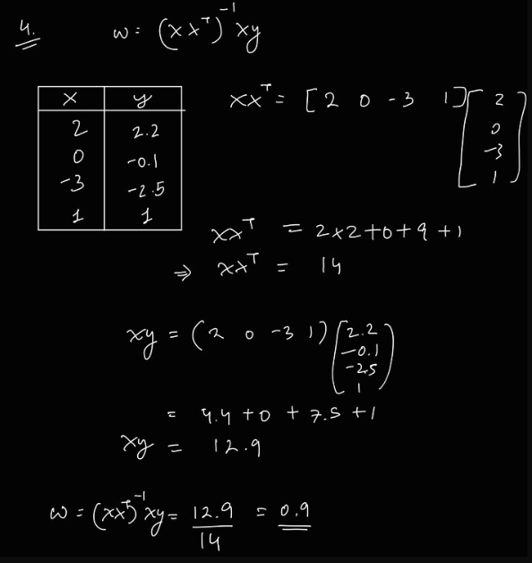
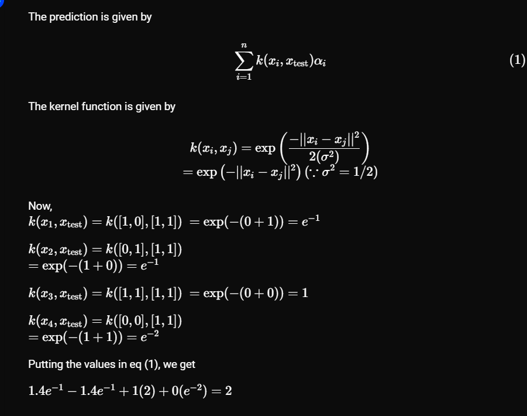

pa q4

pa q8

pa q 10

- An intercept term can be necessary when the independent variables are not centered around zero. If the independent variables are not centered around zero, then the regression line will not pass through the origin, and including an intercept term will be necessary to properly model the data.
The intercept term can have a meaningful interpretation in some cases. For example, in a linear regression model that predicts a person’s salary based on their level of education, the intercept term represents the expected salary for someone with no education. This can be a useful piece of information for interpreting the model and making predictions.
In summary, while mean-centering the dataset can be a useful technique in some cases, including an intercept term in the regression model is often preferred for accuracy and interpretability.

