- K-MEANS and K-MEANS++ algorithm
    

    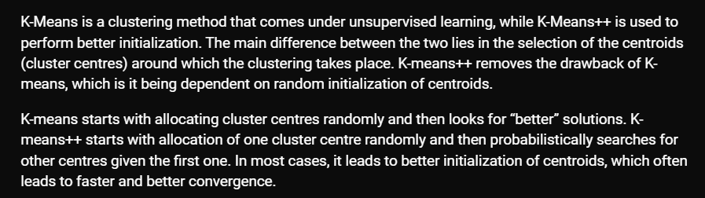

- AQ 3.1 q3

    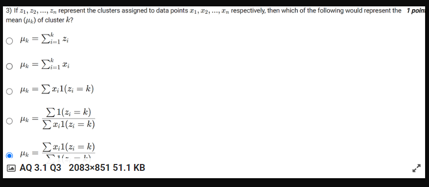

    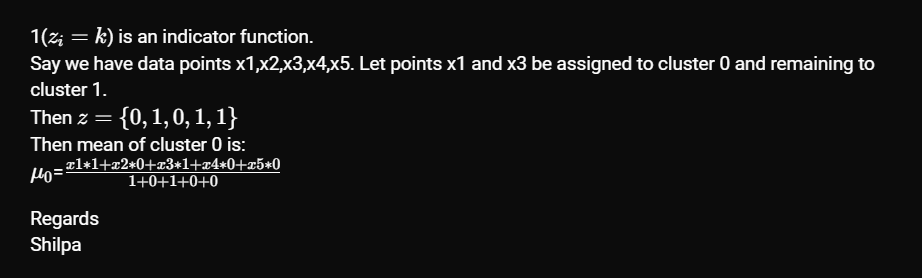

- Veronoi 
  
    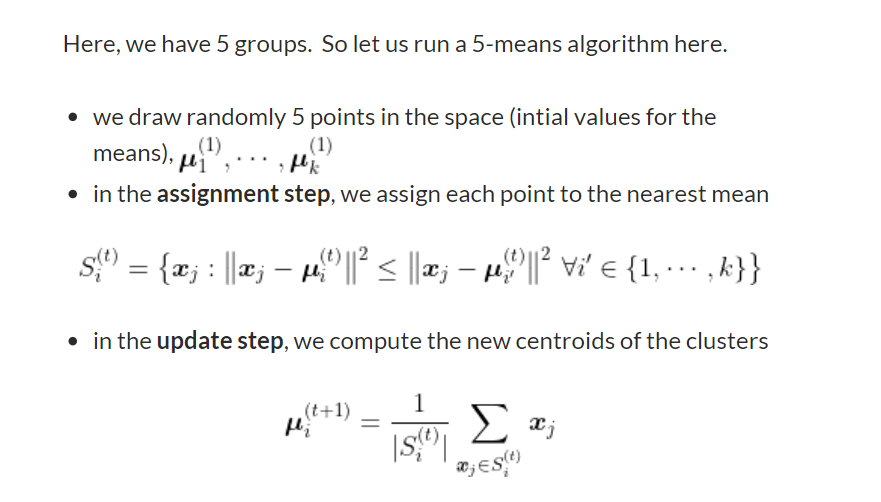

- Week 3 Practice Assignment Q5

    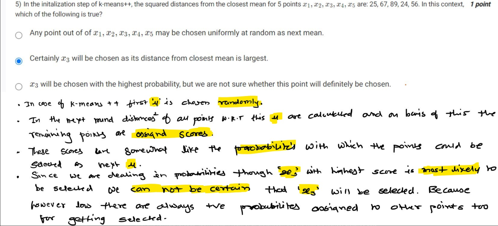

-KMEANS SEQUENCE
    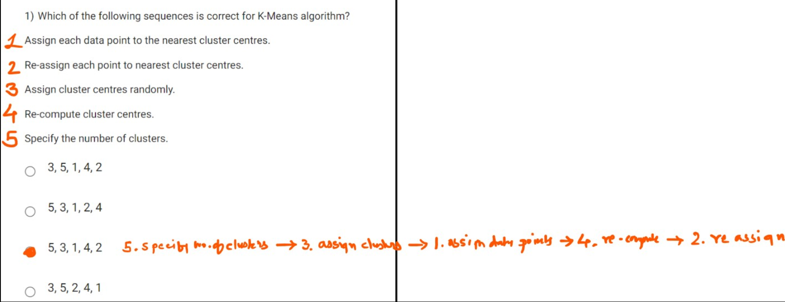

-voronai region cluster
    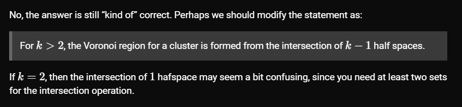

## Both k-means & k-means++ produce near optimal solutions… optimal is not possible to find as the original problem is NP-Hard

- KMEANS OBJECTIVE FUNCTION
    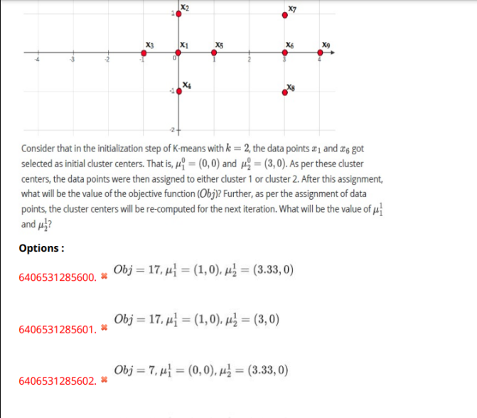

    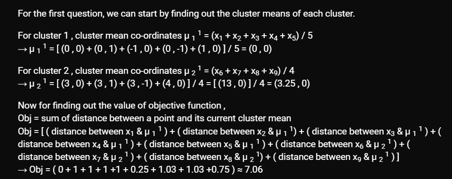

- PCA

    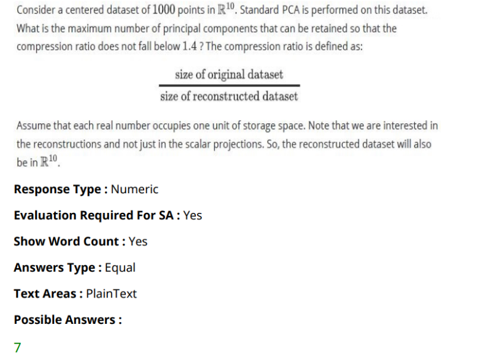

- GA Q8
    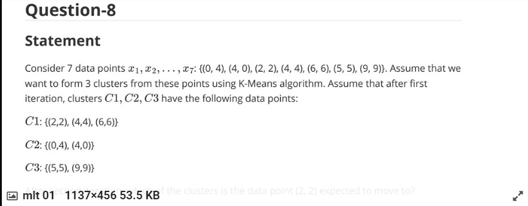
        - For cluster 2 example,
$=(\frac{(x_1 + x_2)}{2},\frac{(y_1 + y_2)}{2})$
$=( \frac{(0 + 4)}{2},\frac{(4 + 0)}{2})$
$=(2,2)$

- For k-means initialization, the cluster means are chosen uniformly randomly and the Lloyd’s algorithm is applied.

- For k-means++ initialization, probability scores are calculated for every data point to determine the initial mean so that they are as far away as possible. Therefore this initialization of cluster centroids using k-means++ take lots of system resources.

-GA Q3
-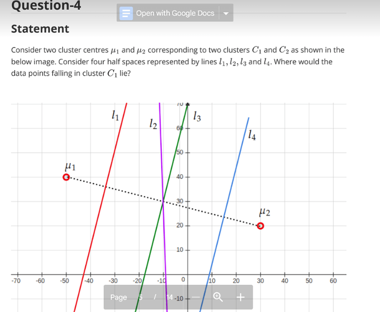

    - Data points of cluster C_1 will lie left of l_3 because l_3 bisects the line joining \mu_1 and \mu_2 perpendicularly creating half spaces left and right of l_3.

    